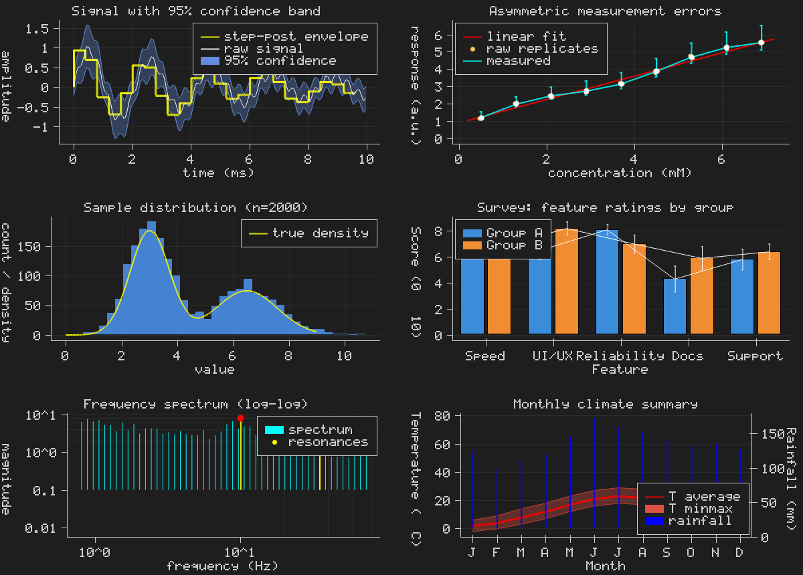

# plotmini

Single-header C99 library for software-rendered plots. Zero dependencies beyond libc.

Output is a raw pixel framebuffer — attach any backend (minifb, SDL, file, …).

<p align="center">
  
</p>

## Quick Start

```c
#define PLOTMINI_IMPLEMENTATION
#include "plotmini.h"

unsigned char pixels[800 * 600 * 4];
plm_fb fb = plm_fb_create(pixels, 800, 600, PLM_RGBA8);

plm_plot p;
plm_plot_init(&p);
p.title = "sin(x)";

float x[100], y[100];
for (int i = 0; i < 100; i++) { x[i] = i * 0.1f; y[i] = sinf(x[i]); }
plm_plot_add_line(&p, x, y, 100, (plm_line_style){PLM_BLUE, 1.0f, "sin(x)", 0});

plm_render(&p, &fb);
plm_fb_save_bmp(&fb, "plot.bmp");
```

## Features

- **Line**, scatter, bar, histogram, stem, step, error bar, band (fill between)
- Wu anti-aliased lines, sub-pixel clipping, variable thickness
- Log / linear / categorical axes, auto-range, nice-number ticks
- Subplot grids with independent axes per cell
- Dual Y-axis (left + right), per-axis font scale
- Legends, custom tick formatters, asymmetric error bars
- Dark / light theme, configurable margins, grid lines
- `plm_imshow` — colormapped 2D arrays
- `plm_fb_save_bmp` — write framebuffer to BMP file
- RGBA8 or GRAY8 pixel formats

## Subplots

```c
plm_figure fig;
plm_figure_init(&fig, 2, 2);

plm_plot *p = plm_figure_plot(&fig, 0, 0);
p->title = "sin(x)";
plm_plot_add_line(p, x, y, n, (plm_line_style){PLM_BLUE, 1.5f, "sin", 0});

plm_figure_render(&fig, &fb);
plm_figure_reset(&fig);
```

## Building Examples

```sh
cd examples && make    # macOS + minifb
./build/01_basic
```

## Config

| Macro | Effect |
|---|---|
| `PLOTMINI_MALLOC` / `PLOTMINI_FREE` | Custom allocator |
| `PLOTMINI_NO_FONT` | Strip embedded 5×7 font |
| `PLOTMINI_GRAYSCALE_ONLY` | Drop RGBA8 |
| `PLOTMINI_DARK_THEME` | Dark background |
| `PLOTMINI_TEXT_SCALE` | Text size multiplier (default 1) |

## License

Public domain (Unlicense).
