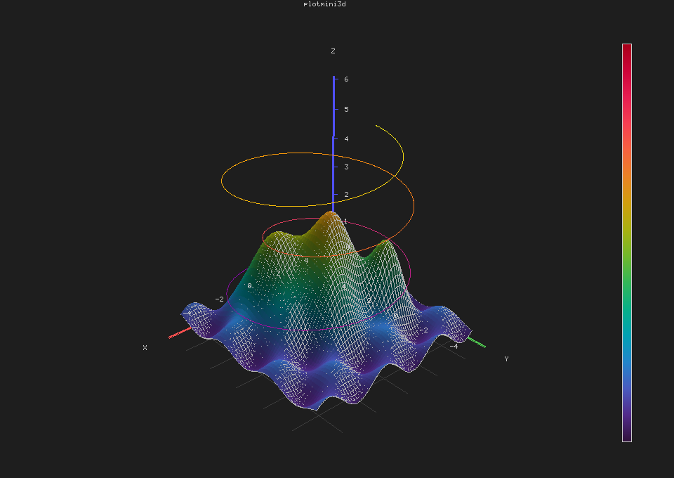

# plotmini

Single-header C99 library for software-rendered 2D and 3D plots. Zero dependencies beyond libc.

Output is a raw pixel framebuffer — attach any backend (minifb, SDL, file, …).

<p align="center">
  
  
</p>

## 2D

```c
#define PLOTMINI_IMPLEMENTATION
#include "plotmini.h"

unsigned char pixels[800 * 600 * 4];
plm_fb fb = plm_fb_create(pixels, 800, 600, PLM_RGBA8);

plm_plot p;
plm_plot_init(&p);
p.title = "sin(x)";

float x[100], y[100];
for (int i = 0; i < 100; i++) { x[i] = i * 0.1f; y[i] = sinf(x[i]); }
plm_plot_add_line(&p, x, y, 100, (plm_line_style){PLM_BLUE, 1.0f, "sin(x)", 0});

plm_render(&p, &fb);
plm_fb_save_bmp(&fb, "plot.bmp");
```

**Primitives**: line, scatter, bar, histogram, stem, step, error bar, band (fill between).  
**Features**: Wu anti-aliasing, log/linear/categorical axes, subplot grids, dual Y-axis, legends, dark/light theme, `plm_imshow`, BMP export.

## 3D

```c
#define PLOTMINI_IMPLEMENTATION
#define PLOTMINI3D_IMPLEMENTATION
#include "plotmini.h"
#include "plotmini3d.h"

unsigned char pixels[900 * 680 * 4];
plm_fb fb = plm_fb_create(pixels, 900, 680, PLM_RGBA8);

plm3d_plot p;
plm3d_plot_init(&p);
p.title = "surface";
p.view.azimuth = -50; p.view.elevation = 25;

float *x = …, *y = …, *z = …;  /* z[i*ny + j] = f(x[i], y[j]) */
plm3d_plot_add_surface(&p, x, y, z, nx, ny,
    (plm3d_surface_style){PLM_GREY(180), 0.5f, PLM_CMAP_TURBO, 0.8f, NULL, 0,
                          0, 0.0f, 0.0f});

plm3d_render(&p, &fb);
plm_fb_save_bmp(&fb, "plot3d.bmp");
```

**Primitives**: surface (filled + wireframe), line, scatter, bar, stem, bivariate histogram.  
**Features**: z-buffer, perspective/ortho, Lambertian lighting, backface culling, custom light direction, colormaps, floor grid, colorbar, legend. Mixed 2D/3D subplot figures via `plm_figure_plot_3d()`.

## Building

```sh
cd examples && make          # macOS + minifb
./build/01_basic             # 2D line plot
./build/20_showcase          # 3D dark-theme showcase
```

## Config

| Macro | Effect |
|---|---|
| `PLOTMINI_MALLOC` / `PLOTMINI_FREE` | Custom allocator |
| `PLOTMINI_NO_FONT` | Strip embedded 5×7 font |
| `PLOTMINI_GRAYSCALE_ONLY` | Drop RGBA8 |
| `PLOTMINI_DARK_THEME` | Dark background |
| `PLOTMINI_TEXT_SCALE` | Text size multiplier (default 1) |

## License

Public domain (Unlicense).
